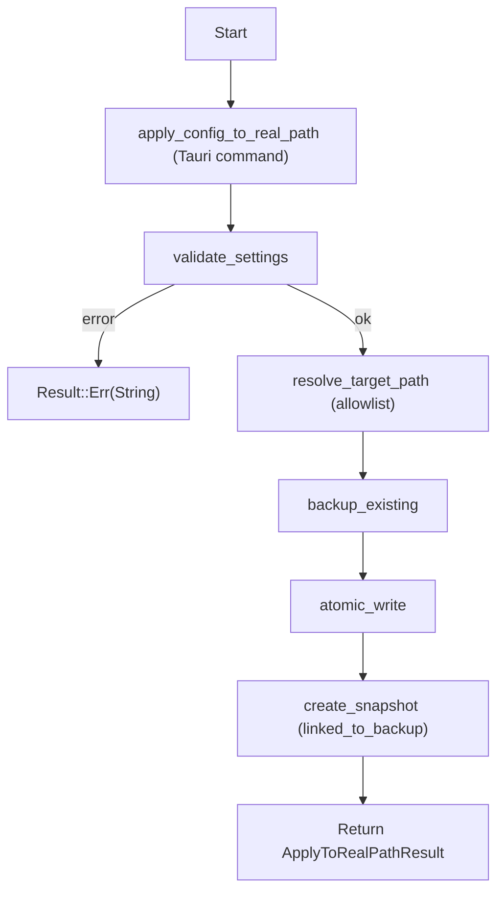
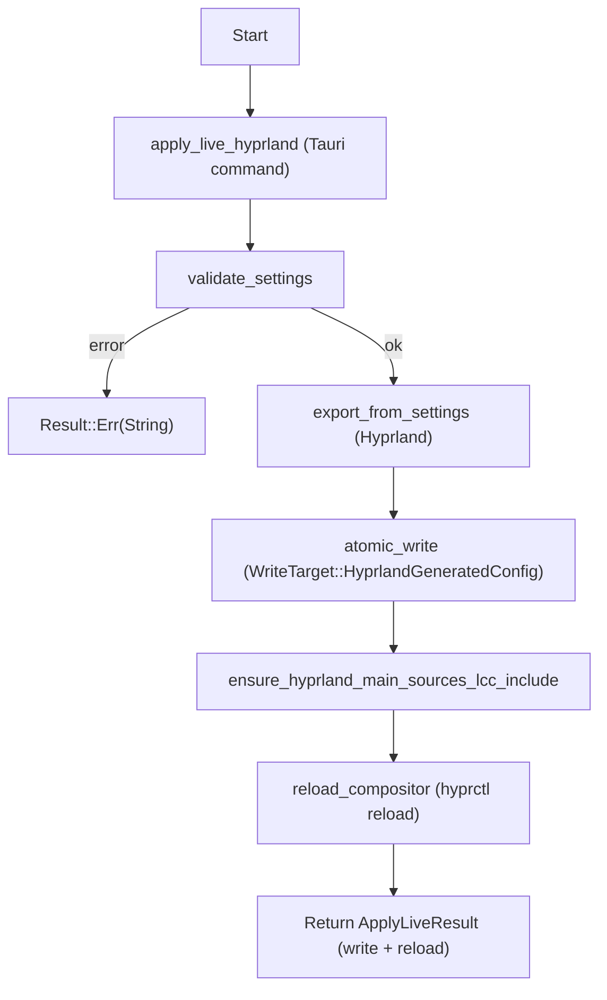
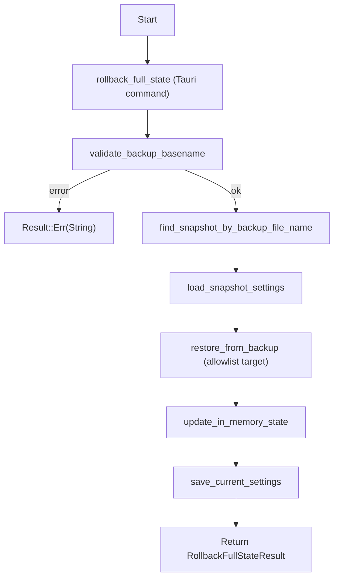

# Linux Control Center — Architecture v2

> **Estado del documento:** vigente desde la fase A del roadmap.
> Reemplaza a `architecture.md`, que describía una "fase 1 con fixtures en memoria" ya superada.

---

## 0. Regla madre del proyecto

La app no edita Linux. **Orquesta cambios reversibles sobre superficies explícitas.**

Toda operación que modifique el sistema debe cumplir los siguientes invariantes sin excepción:

| # | Invariante |
|---|---|
| I-1 | Nunca aceptar rutas arbitrarias del frontend |
| I-2 | Nunca sobrescribir archivos agregadores del usuario (ej. `hyprland.conf`) |
| I-3 | Nunca aplicar sin validación previa del dominio |
| I-4 | Nunca escribir en disco sin backup atómico previo |
| I-5 | Nunca perder la posibilidad de rollback |
| I-6 | Nunca mezclar "estado visual de la UI" con "estado real del sistema" |
| I-7 | Nunca asumir que el archivo en disco sigue siendo lo que la app escribió |

Si cualquier operación rompe uno de estos invariantes, el proyecto deja de ser un control center y se convierte en una colección de mutaciones peligrosas.

---

## 1. Capas del sistema

```
┌──────────────────────────────────────────────────────┐
│  Capa 1: Product UI                                  │
│  apps/desktop/src (React 19 + TypeScript)            │
│  Muestra estado, edita, previsualiza, aplica, revierte│
└───────────────────────┬──────────────────────────────┘
                        │ Tauri IPC — comandos tipados
┌───────────────────────▼──────────────────────────────┐
│  Capa 2: Application Services                        │
│  apps/desktop/src-tauri                              │
│  Orquestación transaccional. Sin lógica de parseo.   │
└────────┬──────────────┬───────────────────────────────┘
         │              │
┌────────▼────────┐  ┌──▼────────────────────────────┐
│  Capa 3:        │  │  Capa 4: Adapters              │
│  Domain Core    │  │  crates/adapters-*             │
│  crates/core-   │  │  Traducen dominio ↔ mundo real │
│  model          │  │  Sin conocimiento de React     │
│  Fuente de      │  │  Sin permisos de escritura     │
│  verdad, sin I/O│  │  directa                       │
└─────────────────┘  └──────────────┬─────────────────┘
                                    │
              ┌─────────────────────▼─────────────────┐
              │  Capa 5: Safe Write / Privileged       │
              │  Boundary                              │
              │  crates/privileged-helper              │
              │  Catálogo cerrado de operaciones       │
              │  permitidas. Compilado en el binario.  │
              └───────────────────────────────────────┘
```

### Responsabilidades por capa

| Capa | Crate / Módulo | Hace | No hace |
|---|---|---|---|
| Product UI | `apps/desktop/src` | Muestra y edita settings, navega páginas, muestra resultados | Arma rutas, ejecuta shell, decide targets |
| Application Services | `apps/desktop/src-tauri` | Orquesta operaciones completas (validate → backup → write → snapshot → reload) | Parsea formatos, conoce la UI |
| Domain Core | `crates/core-model` | Tipos, validación, snapshots, diffs, perfiles, contratos TS generados | I/O de cualquier tipo |
| Adapters | `crates/adapters-*` | Parsea y genera texto de config (`.conf`, `.jsonc`, `.rasi`), lee del sistema real | Decide permisos, guarda estado global |
| Safe Write | `crates/privileged-helper` | Escribe de forma atómica, hace backups, restaura, gestiona includes | Escritura arbitraria, shell passthrough |

---

## 2. Ownership de archivos por subsistema

### 2.1 Hyprland

**Política:** la app no debe poseer ni sobrescribir `~/.config/hypr/hyprland.conf`.

Ese archivo es un **agregador de ecosistema**: el usuario puede tener plugins, monitores, bindings y configuración de entrada que la app no conoce. Sobrescribirlo es destructivo.

**Modelo correcto:**

```
~/.config/hypr/
├── hyprland.conf                  ← propiedad del usuario; la app solo añade un source
└── generated/
    └── linux-control-center.conf  ← única superficie gestionada por la app
```

La app:
1. Genera `linux-control-center.conf` a partir de `HyprlandSettings`
2. Escribe ese archivo de forma atómica con backup
3. Comprueba si `hyprland.conf` ya contiene `source = ./generated/linux-control-center.conf`
4. Si no, lo inserta al final de forma idempotente (sin duplicar, sin reordenar bloques existentes)
5. Ejecuta `hyprctl reload`

**Lo que la app nunca hace sobre `hyprland.conf`:**
- borrar bloques del usuario
- reordenar `source` existentes
- eliminar otros includes

### 2.1.1 Migration & Recovery Strategy (Hyprland)

Esta sección describe cómo llegar al estado “managed include” de forma segura, incluso si
hay instalaciones antiguas o setups dañados por overwrite del archivo principal.

**Casos que debemos soportar:**

- **Caso M-1: Ya está en include managed**: `hyprland.conf` ya contiene el `source` al include de LCC.
  - **acción**: no tocar nada; la inserción es idempotente.

- **Caso M-2: El usuario eliminó el `source` manualmente**
  - **acción**: el siguiente apply live vuelve a insertar el `source` de forma idempotente.
  - **UX**: mostrar aviso “el include estaba desactivado; se reinsertó”.

- **Caso M-3: Instalación antigua sobrescribió `hyprland.conf`**
  - **señal típica**: `hyprland.conf` contiene un encabezado tipo “Generated by … do not edit manually”
    y/o no contiene bloques del usuario.
  - **acción recomendada**:
    1) no sobrescribir más el principal
    2) buscar backups existentes (`*.bak.*`) y ofrecer restauración guiada
    3) restaurar el principal desde backup (si existe) y mantener el include gestionado por LCC separado
  - **nota**: esta recuperación es deliberadamente “semi-automática”: requiere confirmación explícita
    porque implica decidir qué backup es la fuente de verdad.

- **Caso M-4: Setup no estándar (symlink / includes complejos)**
  - **acción**: no reordenar ni normalizar el archivo; solo insertar el `source` si no existe y si se puede
    editar de forma segura con backup.
  - si no se puede: fallar con mensaje accionable (“no se pudo insertar include; revisa permisos/symlink”).

### 2.2 Waybar

**Política actual:** managed full config.

La app gobierna `~/.config/waybar/config.jsonc` completo. El usuario acepta que Waybar esté bajo control de la app. Cada apply crea un backup `config.jsonc.bak.<timestamp>-<uuid>`.

**Evolución futura (Fase D+):** managed fragments, donde la app gestiona solo módulos, altura, posición e iconografía, componiendo el config final desde presets.

### 2.3 Rofi

**Política:** managed full config.

La app gobierna `~/.config/rofi/config.rasi`. Lógica análoga a Waybar: apply atómico con backup.

**Evolución futura:** managed theme include (`@theme "lcc-theme.rasi"`), alineado con el Theme Manager.

---

## 3. Modelo transaccional

Cada acción sensible sigue un protocolo de fases definidas. No hay atajos.

### 3.1 Apply sandbox

No toca el sistema real. Solo genera y escribe en el directorio de datos de la app.

```
1. validate(settings)              → error si inválido
2. export(settings)                → contenido de config
3. write(appDataDir/exported/...)  → escribe en sandbox
4. devolver written_path
```

### 3.2 Apply real

```
1. validate(settings)
2. resolve_target_path(target)     → ruta allowlisted, nunca del frontend
3. backup_existing(target_path)    → backup único con timestamp + UUID
4. atomic_write(target_path, content)
5. create_snapshot(settings, backup_file_name)
6. devolver { backup_file_name, snapshot_id, written_path }
```

**Nota sobre fallos entre write/snapshot:** si `atomic_write` fue exitoso pero `create_snapshot` falla,
la operación debe considerarse **parcialmente completada** (el sistema real cambió, pero falta el vínculo
de recuperación en snapshots). En ese caso:\n
- debe registrarse como **warning/error** en el Operation Journal (Fase C)\n
- debe surfacearse al usuario (“archivo aplicado, pero no se pudo crear snapshot; conserva el backup para rollback”)\n
- no debe ocultarse como éxito silencioso

### 3.3 Apply live

```
1. [todos los pasos de Apply real]
2. reload(target)                  → hyprctl reload / reload permitido
3. devolver { write_result, reload_ok, reload_output }
   └── write y reload son campos separados; nunca se funden
```

Si el reload falla: el archivo escrito en disco sigue siendo válido. La UI lo muestra explícitamente. No hay rollback automático (ver ADR-002).

### 3.4 Rollback full state

```
1. validate(backup_file_name)      → solo basename; el backend reconstruye la ruta
2. locate_snapshot(backup_file_name)
3. load_snapshot_settings(snapshot_id)
4. restore_file(target_path, backup_file_name)
5. restore_settings(snapshot_settings)
6. persist_current_settings()
7. devolver restored_settings a la UI
```

Ningún paso acepta una ruta absoluta del frontend.

### 3.5 Diagramas de flujo (operaciones canónicas)

#### Apply real



#### Apply live (Hyprland)



#### Rollback full state



---

## 4. Modelo de dominio — `core-model`

### Entidades actuales (implementadas)

| Tipo | Rol |
|---|---|
| `AppSettings` | Settings completos: appearance + hyprland + waybar + rofi |
| `AppearanceSettings` | Tema, accent, fuente, iconos, cursor |
| `HyprlandSettings` | gaps, border, rounding, blur, animations |
| `WaybarSettings` | position, height, módulos left/center/right |
| `RofiSettings` | modi, font, icons, display labels |
| `SettingsProfile` | Settings nombrado con metadata |
| `SettingsSnapshot` | Estado inmutable ligado a una operación |
| `SettingsDiff` | Comparación entre dos `AppSettings` |

### Entidades a añadir en fases futuras

| Tipo | Propósito |
|---|---|
| `ApplyPlan` | Descripción de qué se va a hacer antes de hacerlo |
| `ApplyResult` | Resultado estructurado de un apply (write + reload separados) |
| `ReloadResult` | `{ ok, output, process }` |
| `RollbackResult` | `{ restored_settings, restored_file_path }` |
| `BackupMetadata` | `{ target, timestamp, uuid, size_bytes }` |
| `ManagedTarget` | Enum de targets allowlisted |
| `GeneratedArtifact` | `{ target, content_hash, written_at }` |
| `ExternalStateFingerprint` | `{ target, content_hash, mtime, snapshot_id, backup_file_name }` — detecta desincronización entre app y disco |
| `OperationJournalEntry` | Ver sección Persistencia |
| `ThemeTokenSet` | Tokens visuales compartidos entre subsistemas (Fase D) |
| `WallpaperSettings` | Catálogo y apply de wallpapers (Fase E) |

### `ExternalStateFingerprint`

Este tipo es el mecanismo para detectar desincronización:

```
app cree que escribió X en target T en tiempo ts
→ fingerprint = { target: T, hash: hash(X), mtime: mtime(T), snapshot_id, backup_file_name }
→ al arrancar o al aplicar: comparar fingerprint con estado real del disco
→ si mtime o hash difieren: el usuario modificó el archivo externamente → advertir, no sobrescribir silenciosamente
```

#### Decisiones concretas (para que sea ejecutable)

- **hash**: SHA-256 del contenido escrito (hex lowercase).
- **cuándo se calcula**:
  - después de `atomic_write` exitoso (para registrar “lo que realmente quedó en disco”)
  - al arrancar (para comprobar que el disco no cambió desde el último apply)
  - antes de `apply_real`/`apply_live` (para detectar modificaciones externas recientes)
- **qué hace la app ante mismatch**:
  - **por defecto: bloqueo del apply** con mensaje claro y opciones:
    - “Importar estado actual del disco” (reconstruye `AppSettings` desde readers y actualiza la UI)
    - “Forzar apply” (solo si el usuario confirma; crea backup igualmente y registra operación)
  - **nunca** sobrescribe silenciosamente: eso rompería I-7.

---

## 5. Frontera del helper — catálogo de operaciones permitidas

`privileged-helper` no es una mini shell con root. Es un **catálogo cerrado** de operaciones.

### Nota sobre el nombre (“privileged”)

En el estado actual del repo, este crate actúa como una **safe write boundary dentro del mismo proceso**
(no es un “helper” separado con un contexto de permisos distinto).

El nombre “privileged-helper” se mantiene por compatibilidad y por intención de roadmap: en una fase futura
podría evolucionar a una frontera de permisos real (polkit / helper separado), pero la regla sigue siendo la misma:
catálogo cerrado, allowlist compilada y sin ejecución arbitraria.

### Operaciones permitidas

| Función | Descripción |
|---|---|
| `resolve_target_path(target)` | Traduce `WriteTarget` a ruta real via allowlist compilada |
| `backup_existing(target_path)` | Crea `{path}.bak.{timestamp}-{uuid}` antes de cualquier write |
| `atomic_write(target_path, content)` | Escribe en tempfile, luego `rename` (atómico en mismo filesystem) |
| `restore_from_backup(target_path, backup_file_name)` | Restaura solo desde basename; reconstruye ruta internamente |
| `ensure_managed_include(main_file, include_file, marker)` | Inserta idempotentemente un `source` en el archivo principal |
| `reload_hyprland()` | Ejecuta `hyprctl reload`; devuelve `{ ok, output }` |
| `reload_waybar()` | Futuro (Fase F) |

### Operaciones explícitamente prohibidas

- Escritura en rutas arbitrarias
- Lectura de rutas arbitrarias
- Ejecución de comandos shell arbitrarios
- Control genérico de systemd (enable/disable/start/stop sin allowlist específica)
- Exposición de `write_file(path: String, content: String)` sin validación de target

La allowlist de targets está compilada en el binario; no puede expandirse en tiempo de ejecución.

---

## 6. Contrato IPC frontend/backend

Los tipos de entrada y salida de cada familia están generados a TypeScript via `ts-rs`. El frontend no construye tipos ad hoc por pantalla.

### 6.0 Tabla global: operaciones user-facing vs internal-only

| Operación | Categoría | Notas |
|---|---|---|
| `get_current_settings` | User-facing | Fuente de verdad para inicializar la UI |
| `save_settings` | User-facing | Persiste `settings.toml` |
| `import_system_settings` | User-facing | Importa desde disco real; el caller decide si persiste |
| `preview_*` | User-facing | No toca disco |
| `apply_config_to_sandbox` | User-facing | No toca sistema real |
| `apply_config_to_real_path` | User-facing | Escribe con backup atómico; crea snapshot |
| `apply_live_hyprland` | User-facing | Write + `hyprctl reload` con estado separado |
| `rollback_full_state` | **User-facing (canónica)** | Rollback consistente (archivo + settings) |
| `rollback_config_file` | Internal/legacy | Solo archivo; puede dejar UI desincronizada |
| `list_systemd_units` | User-facing | Solo lectura |
| `get_systemd_unit` | User-facing | Solo lectura |

### Settings API

| Comando | Entrada | Salida |
|---|---|---|
| `get_current_settings` | — | `AppSettings` |
| `save_settings` | `{ settings: AppSettings }` | `AppSettings` |
| `import_system_settings` | — | `AppSettings` |
| `preview_hyprland_config` | — | `string` |
| `preview_waybar_config` | — | `string` |
| `preview_rofi_config` | — | `string` |

### Apply API

| Comando | Entrada | Salida |
|---|---|---|
| `apply_config_to_sandbox` | `{ target, snapshot_label? }` | `{ snapshot, write }` |
| `apply_config_to_real_path` | `{ target, snapshot_label? }` | `{ snapshot, write, backup_file_name? }` |
| `apply_live_hyprland` | `{ snapshot_label? }` | `{ snapshot, write, reload_ok, reload_output }` |
| `rollback_full_state` | `{ backup_file_name, target }` | `{ snapshot_id, restored_settings }` |

#### Operaciones user-facing vs internal-only

| Operación | Expuesta como UX canónica | Uso recomendado |
|---|---|---|
| `rollback_full_state` | Sí | **Rollback canónico** (archivo + settings) |
| `rollback_config_file` | No (internal/legacy) | Debug/compat: restaura solo archivo; puede dejar UI desincronizada si se usa sola |

### Snapshots & Profiles API

| Comando | Descripción |
|---|---|
| `create_snapshot` | Crea snapshot del estado actual |
| `list_snapshots` | Lista todos los snapshots |
| `restore_snapshot` | Restaura settings desde snapshot |
| `save_profile` | Guarda estado nombrado |

### System API

| Comando | Descripción |
|---|---|
| `list_systemd_units` | Lista unidades con filtros; fallback a fixture si D-Bus no disponible |
| `get_systemd_unit` | Consulta unidad concreta; requiere D-Bus real |

### APIs futuras

| Familia | Fase | Comandos |
|---|---|---|
| Theme API | D | `list_themes`, `preview_theme`, `apply_theme` |
| Wallpaper API | E | `list_wallpapers`, `preview_wallpaper`, `apply_wallpaper` |

---

## 7. Persistencia

Cuatro clases de datos persistidos, cada una con propósito diferente.

### 7.1 Estado actual

Archivo: `{appDataDir}/settings.toml`

El estado que la app considera "current". Se carga al arrancar. Si no existe (primera vez), se importa del sistema real y se persiste.

### 7.2 Profiles

Directorio: `{appDataDir}/profiles/`

Estados nombrados por el usuario. Formato TOML. Cada uno tiene `id`, `name`, `description`, `created_at`, `settings`.

### 7.3 Snapshots

Directorio: `{appDataDir}/snapshots/`

Estados inmutables ligados a una operación. Cada snapshot tiene:
- `id` (UUID v4)
- `timestamp` (RFC3339)
- `label` (opcional)
- `backup_file_name` (basename del backup de disco asociado, si aplica)
- `settings` (copia completa de `AppSettings`)

### 7.4 Operation Journal (pendiente — Fase C)

Directorio: `{appDataDir}/journal/`

Registra cada operación sensible. Permite:
- depuración post-mortem
- historial útil para el usuario
- base para limpieza de backups huérfanos
- base para la UI "últimas operaciones"

Esquema de cada entrada:

```
OperationJournalEntry {
    operation_id:    UUID v4
    target:          WriteTarget
    action:          "apply_sandbox" | "apply_real" | "apply_live" | "rollback"
    started_at:      RFC3339
    finished_at:     RFC3339
    success:         bool
    snapshot_id:     Option<String>
    backup_file_name: Option<String>
    written_path:    Option<String>
    reload_status:   Option<"ok" | "failed" | "not_attempted">
    error_summary:   Option<String>
}
```

---

## 8. Matriz de testing

### Nivel 1 — Unit tests (en cada crate)

- Validadores de `AppSettings`
- Naming de backups (formato, unicidad)
- Matching backup ↔ target (reconstrucción de ruta desde basename)
- Generación de configs (hyprland, waybar, rofi)
- Parser de configs del sistema (`reader.rs` de cada adapter)
- Idempotencia de `ensure_managed_include`
- Serialización de tipos a TS y TOML
- Funciones de diff

### Nivel 2 — Integration tests (sobre `tempdir`)

- Apply sandbox end-to-end: settings → contenido → archivo escrito
- Apply real sobre `tempdir`: validate → backup → write → snapshot
- Rollback full state sobre `tempdir`: localizar snapshot → restaurar archivo → restaurar settings
- `ensure_managed_include` sobre `hyprland.conf` mock: inserción, idempotencia, no duplicar
- Failures del helper: target fuera de allowlist, contenido demasiado grande, backup fallido

### Nivel 3 — Contract tests

- Tauri command input/output: cada comando registrado tiene tipos de entrada/salida estables
- Tipos TS generados: los bindings generados por `ts-rs` coinciden con los tipos TypeScript usados en el frontend
- Compatibilidad básica: un `settings.toml` escrito en versión N puede cargarse en versión N+1

### Nivel 4 — Smoke tests manuales (documentados)

Antes de cualquier release candidate:

| Test | Pasos | Criterio de éxito |
|---|---|---|
| Hyprland live apply | Editar `gaps_in`, Apply live | Gaps cambian visualmente; `hyprctl reload` responde OK |
| Rollback Hyprland | Tras apply live, ejecutar rollback | Gaps vuelven al valor anterior |
| Waybar apply real | Editar `height`, Apply real | `config.jsonc` actualizado; backup presente |
| Rofi apply real | Editar `font`, Apply real | `config.rasi` actualizado; backup presente |
| App empaquetada | Instalar `.pkg.tar.zst` o AppImage; abrir | App carga sin entorno dev; imports del sistema al primer arranque |
| Sync desde sistema | Botón "Sync desde sistema" | Settings en UI reflejan archivos reales del usuario |

### Gate de release

Una versión solo es release candidate si pasa:

```bash
cargo check --workspace     # sin errores ni warnings bloqueantes
cargo test --workspace      # todos los tests en verde
pnpm build                  # frontend compila sin errores TS
pnpm tauri build            # build empaquetado (release) equivalente
```

Y los smoke tests manuales del nivel 4 están ejecutados y documentados para esa versión.

---

## 9. Observabilidad y forensics

### Logging

- Logs estructurados por operación con `operation_id`
- Nivel `INFO` para operaciones completadas
- Nivel `WARN` para fallbacks (D-Bus no disponible, archivo no encontrado)
- Nivel `ERROR` para fallos en operaciones sensibles
- stdout/stderr de reloads (`hyprctl`) capturados y devueltos en el resultado, no solo logueados

### UI de operaciones recientes (Fase C)

Pantalla "Últimas operaciones" con columnas:

| Campo | Descripción |
|---|---|
| Timestamp | Cuándo ocurrió |
| Target | Qué archivo/subsistema |
| Acción | apply_real, apply_live, rollback… |
| Estado | OK / FAILED |
| Backup | Enlace al backup asociado |
| Snapshot | Enlace al snapshot asociado |

Esa pantalla es la herramienta principal de depuración del usuario sin necesidad de abrir la terminal.

---

## 10. Roadmap de implementación

### Fase A — Documentación y arquitectura real escrita *(actual)*

- Reescribir `README.md`
- Crear este documento (`docs/architecture-v2.md`)
- Crear `docs/operations.md` (guía operacional para el usuario)
- Actualizar metadatos inconsistentes (URLs de repositorio en `Cargo.toml`)

### Fase B — Hyprland managed include *(en progreso)*

- El flujo de Apply live usa el include gestionado + `ensure_managed_include` + `hyprctl reload`
- Pendiente: endurecer la frontera eliminando o restringiendo `WriteTarget::HyprlandMainConfig` a solo inserción idempotente (sin overwrite completo)
- Pendiente: mejorar migración/recuperación con UI guiada (ver “Migration & Recovery Strategy”)

### Fase C — Operation Journal + UI "últimas operaciones"

- Implementar `OperationJournalEntry` en `core-model`
- Persistir entradas en `{appDataDir}/journal/`
- Nuevo comando `list_recent_operations`
- Pantalla "Últimas operaciones" en la UI

### Fase D — Theme Manager

- Tokens visuales compartidos: colores, radios, blur, opacidad, tipografías, spacing
- Tipos: `ThemeTokenSet`, `ThemePreset`, `ThemeVariant`, `ThemeMappingResult`
- Aplicación cross-subsistema: Hyprland include + Waybar config/style + Rofi theme
- Los adapters generan artefactos; el Theme Manager no edita archivos directamente

### Fase E — Wallpaper module

- `crates/wallpaper-catalog`: discovery, metadata, preview
- `crates/wallpaper-engine-adapter`: wrapper del backend existente
- Integración con theme sync (wallpaper → palette → tokens)

### Fase F — Waybar live apply

- Solo cuando `reload_waybar()` tenga una ruta segura y documentada en el entorno real
- No mezclar con Hyprland live en la misma fase de desarrollo

### Fase G — systemd controlled write *(si procede)*

- Solo si existe un caso de uso concreto justificado
- Operaciones adicionales en el allowlist del helper (start/stop/enable/disable de unidades específicas)
- Requiere análisis de superficie de ataque antes de implementar

---

## 11. ADR — Decisiones de arquitectura

### ADR-001: Include gestionado en Hyprland, no ownership del principal

**Contexto:** la app necesita aplicar cambios de gaps, bordes, blur y animaciones en Hyprland.

**Opción A:** sobrescribir `hyprland.conf` completo.
**Opción B:** gestionar un include propio (`generated/linux-control-center.conf`) y asegurar que el principal lo sourcee.

**Decisión:** Opción B.

**Razones:**
- `hyprland.conf` es un agregador: el usuario puede tener bindings, plugins, configuración de monitores, reglas de ventanas y configuración de entrada que la app no conoce ni modela.
- Sobrescribir ese archivo destruye silenciosamente la configuración del usuario fuera del modelo de la app.
- El modelo de include es composable: el usuario puede tener otros includes; la app añade el suyo sin interferir.
- El rollback de un include gestionado es atómico y predecible; el rollback de un archivo complejo no lo es.

**Consecuencias:**
- La app solo puede afectar los campos que genera. No puede eliminar bloques del usuario.
- Hay que gestionar el caso en que el usuario elimine el `source` manualmente (el apply siguiente lo vuelve a insertar).

---

### ADR-002: No rollback automático tras reload fallido

**Contexto:** `hyprctl reload` puede fallar (Hyprland no corre, error de sintaxis en otro include, etc.) después de que la app ya escribió el archivo.

**Opción A:** si reload falla, hacer rollback automático del archivo.
**Opción B:** si reload falla, mantener el archivo escrito, reportar el fallo, dejar rollback manual disponible.

**Decisión:** Opción B.

**Razones:**
- Un rollback automático tras un reload fallido oculta la causa real del fallo. El usuario no sabe si el problema estaba en el archivo generado o en otra parte de su configuración.
- El fallo de `hyprctl reload` puede deberse a un error en otro include que nada tiene que ver con el archivo de la app.
- El archivo generado por la app es sintácticamente válido (la validación ocurre antes del write). Un reload fallido es probable información sobre el entorno, no sobre el contenido generado.
- El rollback manual o semiautomático permite al usuario inspeccionar el estado antes de revertir.

**Consecuencias:**
- La UI debe comunicar claramente: "archivo escrito correctamente / reload fallido" como estados separados.
- El backup siempre existe. El rollback sigue disponible en cualquier momento.

---

### ADR-003: Waybar managed full config antes que managed fragments

**Contexto:** Waybar tiene configuración compleja (módulos, estilos CSS, spacing, iconografía). La app puede gestionar el archivo completo o solo un subconjunto.

**Opción A:** managed fragments desde el principio (la app gestiona solo módulos, altura, posición).
**Opción B:** managed full config primero, evolucionar a fragments cuando el Theme Manager exista.

**Decisión:** Opción B.

**Razones:**
- Los fragments requieren un modelo de composición (cómo fusionar el config del usuario con el de la app) que es complejo de implementar correctamente.
- El full config con backup fuerte y rollback es predecible y auditable desde el primer día.
- El Theme Manager (Fase D) es el momento correcto para introducir fragments, porque en esa fase ya existe un modelo de tokens compartidos que justifica la composición.
- Evitar implementar dos sistemas de gestión simultáneamente.

**Consecuencias:**
- El usuario que usa managed full config acepta que la app gobierne `config.jsonc` completo.
- Hay que documentar esto claramente antes de que el usuario aplique por primera vez.

---

### ADR-004: `rollback_full_state` como rollback canónico de UX

**Contexto:** existen dos operaciones de rollback posibles: restaurar solo el archivo o restaurar archivo + settings.

**Opción A:** exponer y fomentar `rollback_config_file` (archivo únicamente).
**Opción B:** hacer `rollback_full_state` la operación canónica y tratar `rollback_config_file` como internal/legacy.

**Decisión:** Opción B.

**Razones:**
- Un rollback de solo archivo puede dejar la UI y `settings.toml` en un estado desincronizado (rompe I-6/I-7 en la práctica).
- `rollback_full_state` restaura el archivo **y** el snapshot asociado, manteniendo consistencia end-to-end.
- Mantener `rollback_config_file` como herramienta interna es útil para debugging, pero no debe ser la UX principal.

**Consecuencias:**
- La documentación y la UI deben referirse a `rollback_full_state` como rollback estándar.
- `rollback_config_file` queda documentado como internal/legacy.

---

## 12. Definición de "no falla"

El proyecto solo es apto para uso real cuando cumple todos estos criterios:

- Una operación fallida no deja al usuario sin ruta de recuperación
- Ningún target fuera del allowlist puede ser escrito
- La app nunca destruye archivos agregadores del usuario
- Todo apply tiene backup y snapshot asociado y recuperable
- Todo rollback puede explicarse y auditarse
- El frontend y el backend comparten tipos generados; no hay tipos ad hoc por pantalla
- La app puede abrirse empaquetada sin entorno de desarrollo
- Al primer arranque, importa el estado real del sistema como punto de partida
- Existe una forma simple de saber qué cambió, cuándo y por qué

---

## 13. Estado actual del codebase (resumen)

| Subsistema | Reader (import) | Writer | Apply live | Rollback |
|---|---|---|---|---|
| Hyprland | Implementado (`reader.rs`) | Implementado (include gestionado) | Implementado (`hyprctl reload`) | Implementado |
| Waybar | Implementado (`reader.rs`) | Implementado (full config) | No implementado (Fase F) | Implementado |
| Rofi | Implementado (`reader.rs`) | Implementado (full config) | No implementado | Implementado |
| systemd | Implementado (D-Bus real + fixture fallback) | No implementado (solo lectura) | N/A | N/A |
| Appearance (app-level settings) | Implementado (`AppearanceSettings`) | N/A | N/A | N/A |
| Appearance (integración sistema GTK/Qt) | No implementado | No implementado | No implementado | N/A |
| Theme Manager | No implementado | No implementado | No implementado | N/A |
| Wallpapers | No implementado | No implementado | No implementado | N/A |
| Operation Journal | No implementado | No implementado | N/A | N/A |
